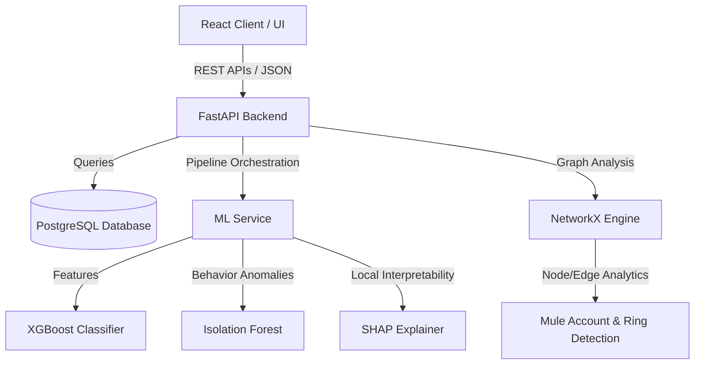

# TRUSTNET: AI-Powered Financial Fraud Intelligence Platform

TRUSTNET is an advanced prototype decision-support and risk-intelligence system designed to detect suspicious digital-payment transactions, identify abnormal user behavior, flag potential mule accounts, and analyze coordinated fraud networks.

> [!WARNING]
> **IMPORTANT SCOPE LIMITATION & PROTOTYPE DISCLAIMER**
> TRUSTNET is a prototype decision-support and risk-intelligence system. It is designed to assist analysts by highlighting risk indicators and network connections.
> - It does **NOT** guarantee fraud prevention or real-time transaction blocking.
> - It does **NOT** automatically declare any flagged transaction or account as definitively fraudulent; all alerts require investigation and human-in-the-loop validation.
> - All data utilized in this project for testing, demonstration, and development is **synthetic** and must not be confused with real, sensitive financial or banking records.

---

## 1. Problem Statement
Digital payment systems have accelerated transaction speeds, but they have also enabled sophisticated, coordinated fraud schemes. Modern fraud is no longer limited to isolated incidents; it often involves:
- **Coordinated Fraud Networks**: Fraud rings transferring funds across multiple accounts.
- **Mule Accounts**: Temporary or compromised accounts used to receive and launder stolen funds.
- **Abnormal Behavioral Profiles**: Rapid changes in transaction velocity, device fingerprints, or transfer patterns.
- **Explainability Gap**: Machine learning models flag transactions as high-risk, but security analysts cannot see the underlying reasoning, delaying manual reviews.

## 2. High-Level Solution
TRUSTNET addresses these challenges by combining machine learning, behavioral profiling, and graph analysis into an interactive, explainable analyst workbench:
- **Hybrid Risk Scoring**: Integrates supervised prediction (XGBoost) with unsupervised anomaly detection (Isolation Forest).
- **Explainable AI (XAI)**: Utilizes SHAP values to detail *why* a particular transaction or profile is flagged.
- **Network Topology Analysis**: Uses NetworkX to map connections between accounts, tracing fund flows to reveal mule structures and fraud rings.
- **Analyst Dashboard**: A modern React-based interface allowing risk teams to inspect risk scores, read explanations, and visually explore the transaction network.

---

## 3. Technology Stack

### Backend
- **Language**: Python
- **API Framework**: FastAPI
- **Graph Framework**: NetworkX
- **Database**: PostgreSQL (via SQLAlchemy ORM)

### Machine Learning & Analytics
- **Supervised Classification**: Scikit-learn, XGBoost
- **Unsupervised Anomaly Detection**: Isolation Forest
- **Explainability**: SHAP (SHapley Additive exPlanations)

### Frontend & Visualization
- **UI Framework**: React (HTML, CSS, JavaScript)
- **Visual Analytics**: Plotly.js / React graph visualization libraries

---

## 4. System Architecture

TRUSTNET follows a modular, decoupled architecture:

### Core Components
1. **Frontend (`/frontend`)**: Single Page Application written in React. It renders transaction history, risk alerts, SHAP explanation charts, and transaction network graphs.
2. **Backend Server (`/backend`)**: FastAPI application providing REST endpoints for ingestion, query, ML execution, and graph visualization.
3. **Machine Learning (`/machine_learning`)**: Module housing feature engineering, model training, scoring logic, and SHAP computation.
4. **Database Schema (`/database`)**: Entity relations mapping transactions, user profiles, alert logs, and network nodes in PostgreSQL.
5. **Datasets (`/datasets`)**: Local workspace repository containing generated synthetic datasets used for training and testing.

---

## 5. Roadmap

### Phase 1: MVP Features (Current Scope)
- **Transaction Preprocessing**: Automated ingestion, feature engineering, and cleaning pipelines.
- **Supervised Fraud Prediction**: XGBoost model trained on engineered transaction features.
- **Unsupervised Anomaly Detection**: Isolation Forest for zero-day behavior patterns.
- **Behavioral Profiling**: Aggregates metrics (velocity, amount deviation) per user/account.
- **Hybrid Risk Score Generation**: Consolidates model predictions into a normalized 0-100 risk score.
- **SHAP-based Explanations**: Visual breakdowns of the contributing risk factors for each flagged transaction.
- **Transaction Network Analysis**: Graph-based representation of accounts (nodes) and transfers (edges).
- **Mule-Account Indicators**: Identifying rapid ins-and-outs, fan-in/fan-out graph patterns.
- **Investigation Dashboard**: Modern user interface for checking alerts and searching transactions.

### Phase 2: Advanced Features (Future Scope)
- **Graph Neural Network (GNN)**: Advanced network-level classification using DGL or PyTorch Geometric.
- **Real-Time Transaction Streaming**: Message brokers (e.g. Kafka/RabbitMQ) for mock streaming.
- **Fraud-Type Classification**: Differentiating account takeover, phishing, and carding.
- **Automated Investigation Reports**: Generating PDF case folders for law enforcement submission.
- **Alert/Notification System**: WebSockets or email notifications for critical alerts.
- **Synthetic UPI Scenario Generator**: Scripted simulator to generate common Indian payment system fraud flows.

---

## 6. Dataset Strategy
To comply with security and privacy regulations:
- No real financial, bank account, or customer identification info is stored.
- We utilize synthetically generated transaction datasets mimicking realistic payment frequencies, amounts, fraud rates, and network topologies.
- Synthetic datasets are saved in the `/datasets` directory and are ignored by Git via `.gitignore` to keep the repository lightweight.

---

## 7. TRUSTNET Risk Intelligence Engine

TRUSTNET consolidates multiple independent signals into a single unified risk score to help fraud analysts prioritize high-risk investigations.

### Scoring Policy Configuration
The engine computes a weighted average of four risk components:
- **Supervised Machine Learning Risk (45%)**: XGBoost model output mapping fraud probability from 0.0 to 1.0 directly onto a 0-100 scale.
- **Unsupervised Anomaly Risk (25%)**: Normalized anomaly scores from the Isolation Forest baseline. Scores are scaled deterministically from `[-0.25, 0.25]` to `[0-100]`.
- **Behavioral Risk (20%)**: Weighted consolidator of user-level behavior deviations (`amount_deviation` [30%], `location_deviation_km` [20%], `is_new_device` [20%], `is_new_ip` [10%], and `velocity` [20%]). Cold starts (NaN values) are ignored in calculations rather than raising false alerts.
- **Network Risk (10%)**: Preliminary indicators checking in-degrees and out-degrees against threshold triggers.

### Risk Prioritization Levels
- **0–29**: LOW
- **30–59**: MEDIUM
- **60–79**: HIGH
- **80–100**: CRITICAL

### Core Limitations
- **No Calibrated Probabilities**: The final 0-100 risk score represents a *decision-support prioritization score*, not a statistical probability of fraud. A score of 85/100 indicates high investigation priority, not an 85% probability of fraudulent activity.
- **Preliminary Network Risk**: Network indicators are limited to simple incoming/outgoing transaction counts. Full relationship graph analyses are processed in subsequent stages.

---

## 8. SHAP-Based Explainable AI (XAI)

TRUSTNET integrates SHAP (SHapley Additive exPlanations) to resolve the "black box" machine learning problem, giving security teams full transparency into why transactions are flagged.

### What SHAP Does
SHAP calculates the exact contribution of each transaction feature (e.g., amount, device change, or velocity) to the XGBoost model's final prediction.

- **Local Explanations**: Provide a feature-by-feature log-odds contribution breakdown for a single transaction. Each contribution pushes the prediction towards higher risk (positive contribution) or lower risk (negative contribution).
- **Global Explanations**: Aggregate local explanations across the entire dataset to rank features by their mean absolute impact, showing which indicators are most critical overall.

### Core Distinctions & Disclaimers
- **Explains the Model, Not the Truth**: SHAP explains why the *XGBoost model* made a specific prediction; it does **not** prove that fraud actually occurred.
- **XGBoost Probability vs. TRUSTNET Risk Score**: SHAP explains the supervised XGBoost fraud probability output. It does **not** explain the final consolidated 0–100 TRUSTNET Risk Score, which is a weighted decision index.

---

## 9. How to Setup and Run
*(Detailed instructions will be added as backend and frontend structures are developed in future steps.)*
